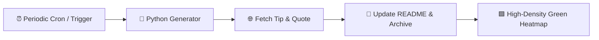

# 🚀 Daily Dev Journal & Digest

> An automated high-frequency developer journal & knowledge repository powered by **GitHub Actions** and **Python**.  
> Runs continuously throughout the day (every 2 hours & on demand), curating programming insights, architecture tips, and quotes.

---

### 📅 Current Edition: `September 24, 2026`
*Last synced: **09:34:43 PM BST** (03:34:43 PM UTC) | Entry #12*

---

### 💡 Tip of the Moment
> **Category:** `Python`  
> **Insight:**  
> Use `dict.get('key', default_value)` instead of direct indexing `dict['key']` to avoid `KeyError` crashes in production.

---

### 💬 Quote of the Moment
> *" Spirituality is recognizing the divine light that is within us all. It doesn't belong to any particular religion; it belongs to everyone. "*  
> — **Muhammad Ali**

---

### 📊 Repository Objectives
- [x] Maintain high-frequency, authentic GitHub contributions (10+ commits/day).
- [x] Continuous automated workflow execution via GitHub Actions.
- [x] Build an extensive knowledge repository of development best practices.

📜 View all historical updates in [ARCHIVE.md](file:///C:/Users/ASUS/.gemini/antigravity/scratch/daily-dev-journal/ARCHIVE.md).

---
*Maintained with ❤️ by GitHub Actions Automation.*
