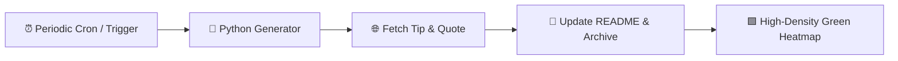

# 🚀 Daily Dev Journal & Digest

> An automated high-frequency developer journal & knowledge repository powered by **GitHub Actions** and **Python**.  
> Runs continuously throughout the day (every 2 hours & on demand), curating programming insights, architecture tips, and quotes.

---

### 📅 Current Edition: `September 24, 2026`
*Last synced: **09:34:27 PM BST** (03:34:27 PM UTC) | Entry #6*

---

### 💡 Tip of the Moment
> **Category:** `Architecture`  
> **Insight:**  
> High cohesion and loose coupling: Modules should do one thing well with minimal dependencies on other modules.

---

### 💬 Quote of the Moment
> *" There cannot be self-restraint in the absence of desire: when there is no adversary, what avails thy courage? Hark, do not castrate thyself, do not become a monk: chastity depends on the existence of lust. "*  
> — **Rumi**

---

### 📊 Repository Objectives
- [x] Maintain high-frequency, authentic GitHub contributions (10+ commits/day).
- [x] Continuous automated workflow execution via GitHub Actions.
- [x] Build an extensive knowledge repository of development best practices.

📜 View all historical updates in [ARCHIVE.md](file:///C:/Users/ASUS/.gemini/antigravity/scratch/daily-dev-journal/ARCHIVE.md).

---
*Maintained with ❤️ by GitHub Actions Automation.*
