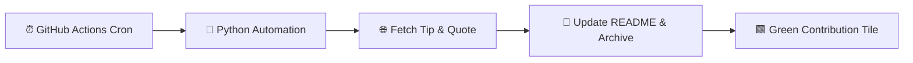

# 🚀 Daily Dev Journal & Digest

> An automated daily developer journal & knowledge repository powered by **GitHub Actions** and **Python**.  
> Every day at 00:00 UTC, this repository automatically curates a fresh programming tip, architectural insight, and inspirational quote.

---

### 📅 Today's Edition: `September 24, 2026`
*Last synced: **09:27 PM BST** (03:27 PM UTC)*

---

### 💡 Tip of the Day
> **Category:** `DevOps & Docker`  
> **Insight:**  
> Order your Dockerfile instructions from least frequently changed to most frequently changed (e.g., copy `package.json` and install dependencies before copying source code) to maximize layer caching.

---

### 💬 Quote of the Day
> *" It Is From Books That Wise People Derive Consolation In The Troubles Of Life. "*  
> — **Victor Hugo**

---

### 📊 Repository Objectives
- [x] Maintain an active, unbroken, genuine GitHub contribution streak.
- [x] Learn and automate CI/CD workflows using GitHub Actions.
- [x] Build an ever-growing archive of developer knowledge and best practices.

📜 View past daily entries in [ARCHIVE.md](file:///C:/Users/ASUS/.gemini/antigravity/scratch/daily-dev-journal/ARCHIVE.md).

---
*Created with ❤️ by an Automated Workflow.*
