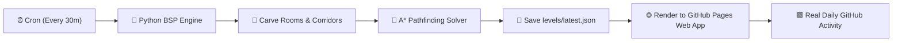

# ⚔️ RogueRealm — Procedural Roguelike Engine

> An automated, algorithmic Roguelike dungeon generator powered by **GitHub Actions**, **Python (BSP & A\* Pathfinding)**, and **HTML5 Canvas**.  
> Every 30 minutes, this repository automatically designs, verifies, and publishes a brand new solvable Roguelike level!

[](https://github.com/abushaidislam/roguerealm/actions)
[](levels/latest.json)
[](levels/latest.json)
[](levels/latest.json)
[](https://abushaidislam.github.io/roguerealm/)

---

### 🕹️ [▶️ CLICK HERE TO PLAY THIS REALM ONLINE IN YOUR BROWSER](https://abushaidislam.github.io/roguerealm/)
*Use Arrow Keys / WASD on PC, or the Touch D-Pad on Mobile to explore, fight monsters, grab the key, and reach the exit!*

---

## 🗺️ Current Dungeon: `Crypt of the Cursed Knight #15`
*Generated at: **September 26, 2026 - 03:51 PM BST** | Seed: `0xBF192C`*

```text
🧱🧱🧱🧱🧱🧱🧱🧱🧱🧱🧱🧱🧱🧱🧱🧱🧱🧱🧱🧱🧱🧱🧱🧱🧱🧱🧱🧱🧱🧱
🧱🧱🧱🧱🧱🧱🧱🧱🧱🧱            🧱🧱🧱🧱🧱          🧱🧱🧱🧱
🧱🧱🧱🧱🧱🧱🧱🧱🧱🧱    🐉  🐉  🧱🧱🧱🧱🧱  💀      🧱🧱🧱🧱
🧱🧱          🧱🧱🧱            🧱🧱🧱🧱🧱  🐉🗝️    🧱🧱🧱🧱
🧱🧱  🐉  🐉🐉🧱🧱🧱            🧱🧱🧱🧱🧱  💀      🧱🧱🧱🧱
🧱🧱    🚪🪤          🧪  👾💎                          🧱🧱
🧱🧱        💀🧱🧱🧱            🧱🧱🧱🧱🧱🧱🧱  🧱🧱🧱  🧱🧱
🧱🧱🧱  🧱🧱🧱🧱🧱🧱            🧱🧱🧱🧱🧱🧱🧱  🧱🧱🧱  🧱🧱
🧱🧱🧱  🧱🧱🧱🧱🧱🧱            🧱🧱        🧱  🧱        🧱
🧱        🧱🧱🧱🧱🧱🧱🧱🧱🧱🧱🧱🧱🧱  💀    🧱  🧱    👾  🧱
🧱        🧱🧱🧱🧱🧱🧱                      🧱      💎    🧱
🧱        🧱🧱🧱🧱🧱🧱  🧱🧱🧱🧱🧱🧱      🪤🧱🧱🧱        🧱
🧱      🪤🧱🧱🧱🧱          🧱🧱🧱🧱  🐉🪤  🧱🧱🧱        🧱
🧱                                        🧱🧱🧱🧱🧱🧱🧱🧱🧱
🧱      🧪🧱🧱🧱🧱    🧙‍♂️    🧱🧱🧱🧱🧱🧱🧱🧱🧱🧱🧱🧱🧱🧱🧱🧱
🧱    🐉  🧱🧱🧱🧱          🧱🧱🧱🧱🧱🧱🧱🧱🧱🧱🧱🧱🧱🧱🧱🧱
🧱    🪤  🧱🧱🧱🧱🧱🧱🧱🧱🧱🧱🧱🧱🧱🧱🧱🧱🧱🧱🧱🧱🧱🧱🧱🧱🧱
🧱🧱🧱🧱🧱🧱🧱🧱🧱🧱🧱🧱🧱🧱🧱🧱🧱🧱🧱🧱🧱🧱🧱🧱🧱🧱🧱🧱🧱🧱
```

### 📊 Level Statistics & Solvability
| Metric | Value | Metric | Value |
| :--- | :--- | :--- | :--- |
| **Difficulty Rating** | **`NIGHTMARE`** | **Rooms Carved** | `7 Rooms` |
| **Monsters Active** | `14 Enemies` (`👾`, `💀`, `🐉`) | **Hidden Traps** | `5 Spikes` (`🔥`) |
| **Treasure Chests** | `2 Chests` (`💎`) | **Minimum A\* Steps** | `60 Steps to Exit` |

---

## 🧭 Map Legend
* 🧙‍♂️ **Player:** Your hero. Move with `W A S D` or Arrow Keys.
* 🗝️ **Dungeon Key:** Required to unlock the iron exit door.
* 🚪 **Exit Gate:** Reach here alive with the key to beat the dungeon!
* 👾 **Goblin:** Quick enemy (2 HP, 1 ATK).
* 💀 **Skeleton:** Tough enemy (3 HP, 2 ATK).
* 🐉 **Shadow Beast:** Lethal mini-boss (5 HP, 3 ATK).
* 🔥 **Spike Trap:** Hidden hazard, deals 2 damage when stepped on.
* 🧪 **Potion:** Restores 3 Health Points.
* 💎 **Treasure:** Collect for high score!

---

## ⚙️ Architecture & Automated Pipeline



* Levels are archived chronologically in [`levels/archive/`](levels/archive).
* Playable web client source code lives in [`web/`](web/).

---
*Generated automatically with ❤️ by Procedural Game AI.*
